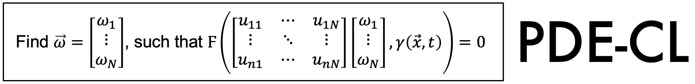

<br/>
<p align="center"></p>

----


## Setup on MacBook Pro

Install Miniconda or Anaconda following the directions [here](https://docs.conda.io/projects/conda/en/latest/user-guide/install/macos.html).

Open the Terminal.
Navigate to the directory where you want the code to reside.
```
git clone https://github.com/gigantocypris/PINN.git
```

Create conda environment with PyTorch 2.0: 
```
conda create -n pytorch2 python=3.9
conda activate pytorch2
conda install pytorch torchvision torchaudio -c pytorch
python -m pip install -U pip
python -m pip install -U matplotlib
python -m pip install scipy
conda deactivate
```

To use the conda environment:
```
conda activate pytorch2
```

## How to run the code on MacBook Pro

Activate the conda environment:
```
conda activate pytorch2
```

Navigate to the PINN directory and run:
```
python main.py
```

## Setup on NERSC

Open a Perlmutter terminal. To install code in `$SCRATCH`:
```
cd $SCRATCH
git clone https://github.com/gigantocypris/PINN.git
```

Load Python and create the conda environment:
```
module load python
conda create -n PINN python=3.8 -y
conda activate PINN
```

Start an interactive session:
```
salloc -N 1 --time=60 -C gpu -A m3562_g --qos=interactive --ntasks-per-gpu=8 --cpus-per-task=4
```

Install PyTorch:
```
conda install pytorch==2.0 torchvision torchaudio pytorch-cuda=11.7 -c pytorch -c nvidia
```

Test the PyTorch install:
```
cd $SCRATCH/PINN
python test_pytorch_install.py
```

Install the other conda dependencies:
```
conda install h5py
```

Upgrade pip:
```
python -m pip install --upgrade pip
```

Install the other pip dependencies:
```
python -m pip install -r requirements.txt
```

## Setup on Swarthmore server

```
ssh -Y microway@130.58.53.85
```

Use the NERSC directions except for the `module load python` command

clone directory to /home/microway/Documents


## How to run the code on NERSC

Open a Perlmutter terminal.
Run the following commands to use the conda environment and start an interactive session:
```
module load python
conda activate PINN
salloc -N 1 --time=60 -C gpu -A m3562_g --qos=interactive --ntasks-per-gpu=1 --cpus-per-task=32
```

Navigate to the directory and run the code:
```
cd $SCRATCH/PINN
python main.py
```

## How to run the SLURM script on NERSC

Open a Perlmutter terminal.
```
module load python
conda activate PINN
```

Navigate to the output directory and run the code:
```
cd $SCRATCH/output_PINN
sbatch $SCRATCH/PINN/slurm_train.sh
```
Submitted batch job 10212188


## Resources

Learning differentiable solvers for systems with hard constraints
https://arxiv.org/abs/2207.08675

PINN:
Institut Fresnel paper with data:
https://iopscience.iop.org/article/10.1088/0266-5611/21/6/S09

Efficient inversion of multiple-scattering model for optical diffraction tomography (SEAGLE extension)
https://opg.optica.org/oe/fulltext.cfm?uri=oe-25-18-21786&id=371123


A Fast Algorithm of Cross-Correlated Contrast Source Inversion in Homogeneous Background Media
https://ieeexplore.ieee.org/document/10044704
https://github.com/TUDsun/CC-CSI
https://github.com/TUDsun/GMMV-LIM

T-Matrix Backprojection Imaging for Scalar
and Vector Electromagnetic Waves
https://ieeexplore.ieee.org/stamp/stamp.jsp?tp=&arnumber=10006692
https://github.com/nasa-jpl/Waveport


Deep Learning-Based Inverse Scattering With
Structural Similarity Loss Functions
https://ieeexplore.ieee.org/stamp/stamp.jsp?tp=&arnumber=9220912
https://github.com/VainF/pytorch-msssim

Closing the Gap of Simulation to Reality in
Electromagnetic Imaging of Brain Strokes
via Deep Neural Networks
https://ieeexplore.ieee.org/stamp/stamp.jsp?tp=&arnumber=9274540
https://github.com/thisismygitrepo/emi_da

Learning distributed computing with PyTorch:
https://medium.com/codex/a-comprehensive-tutorial-to-pytorch-distributeddataparallel-1f4b42bb1b51
https://yangkky.github.io/2019/07/08/distributed-pytorch-tutorial.html
https://theaisummer.com/distributed-training-pytorch/
https://towardsdatascience.com/distribute-your-pytorch-model-in-less-than-20-lines-of-code-61a786e6e7b0


Physics-informed neural networks for inverse problems in nano-optics and metamaterials
Yuyao Chen, Lu Lu, George Em Karniadakis, and Luca Dal Negro
https://opg.optica.org/oe/fulltext.cfm?uri=oe-28-8-11618&id=429761

Physics-informed neural networks with hard constraints for inverse design
Lu Lu, Raphael Pestourie, Wenjie Yao, Zhicheng Wang, Francesc Verdugo, Steven G. Johnson
https://epubs.siam.org/doi/10.1137/21M1397908

Efficient inversion of multiple-scattering model for optical diffraction tomography
Emmanuel Soubies, Thanh-An Pham, and Michael Unser
https://opg.optica.org/oe/fulltext.cfm?uri=oe-25-18-21786&id=371123

Lorenz–Mie theory for 2D scattering and resonance calculations
Denis Gagnon and Louis J Dubé
https://iopscience.iop.org/article/10.1088/2040-8978/17/10/103501